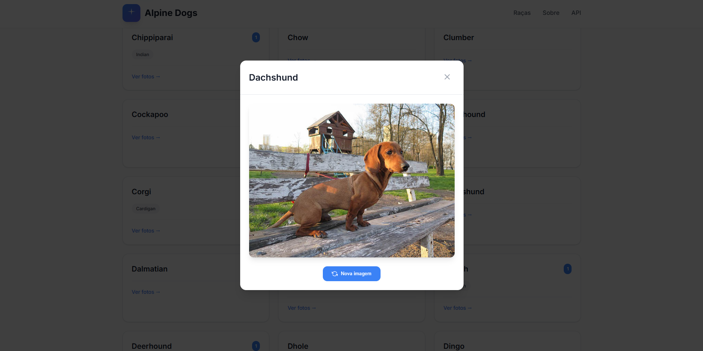

# Alpine Dogs - Explorador de Raças de Cães



---

## Sobre 

**Alpine Dogs** é uma aplicação web moderna que permite explorar centenas de raças de cães com imagens reais. O site utiliza a [Dog CEO API](https://dog.ceo/dog-api/) para buscar informações sobre diferentes raças e suas sub-raças, proporcionando uma experiência interativa e educativa.

O objetivo principal deste projeto é demonstrar o poder e simplicidade do **Alpine.js** - um framework JavaScript minimalista que permite criar interfaces reativas sem a complexidade de frameworks maiores como React ou Vue.js.

---

## 🚀 Tecnologias Utilizadas

- **HTML5** - Estrutura semântica da aplicação
- **CSS3** - Estilização moderna com CSS Grid, Flexbox e variáveis CSS
- **JavaScript (ES6+)** - Lógica da aplicação e consumo de API
- **Alpine.js** - Framework reativo para interatividade
- **Inter Font** - Tipografia moderna do Google Fonts
- **Dog CEO API** - API REST para dados de raças de cães
- **Markdown** - Documentação do projeto

---

## 🎯 O que é Alpine.js?

Alpine.js é um framework JavaScript leve (apenas 15kb) que oferece a reatividade e funcionalidades declarativas de frameworks maiores, mas com a simplicidade de usar diretamente no HTML. É perfeito para adicionar comportamento interativo a sites sem a necessidade de um processo de build complexo.

### Principais características:
- ✅ **Leve**: Apenas 15kb minificado
- ✅ **Sem build**: Funciona diretamente no navegador
- ✅ **Reativo**: Atualizações automáticas da interface
- ✅ **Declarativo**: Lógica diretamente no HTML
- ✅ **Fácil de aprender**: Sintaxe similar ao Vue.js

---

## 📋 Pré-requisitos

Antes de começar, você precisa ter instalado em sua máquina:

### Para iniciantes absolutos:

1. **Um navegador web** (Chrome, Firefox, Edge, Safari)
2. **Um editor de código** - Recomendamos:
   - [Visual Studio Code](https://code.visualstudio.com/) (gratuito)
   - [Sublime Text](https://www.sublimetext.com/)
   - [Atom](https://atom.io/)

### Opcional (para desenvolvimento avançado):
- [Git](https://git-scm.com/) - Para controle de versão
- [Node.js](https://nodejs.org/) - Para ferramentas de desenvolvimento

---

## 🛠️ Como usar este projeto

### Método 1: Download direto (Mais fácil para iniciantes)

1. **Baixe os arquivos**:
   - Clique no botão verde "Code" no GitHub
   - Selecione "Download ZIP"
   - Extraia o arquivo ZIP em uma pasta de sua escolha

2. **Abra o projeto**:
   - Navegue até a pasta extraída
   - Clique duas vezes no arquivo `index.html`
   - O site abrirá no seu navegador padrão

### Método 2: Usando Git (Para desenvolvedores)

```bash
# Clone o repositório
git clone https://github.com/seu-usuario/alpine-dogs.git

# Entre na pasta do projeto
cd alpine-dogs

# Abra no seu editor de código
code .

# Ou abra diretamente no navegador
start index.html  # Windows
open index.html   # Mac
xdg-open index.html # Linux
```

---

## 📖 Tutorial Alpine.js - Do Zero ao Herói

### 1. Incluindo Alpine.js no seu projeto

Primeiro, você precisa incluir o Alpine.js no seu HTML. Existem duas formas:

#### Via CDN (mais fácil):
```html
<script defer src="https://unpkg.com/alpinejs@3.x.x/dist/cdn.min.js"></script>
```

#### Download local:
1. Baixe o arquivo do [site oficial](https://alpinejs.dev/)
2. Coloque na pasta do seu projeto
3. Inclua no HTML: `<script defer src="alpine.min.js"></script>`

### 2. Conceitos básicos do Alpine.js

#### x-data: Definindo dados reativos
```html
<!-- Cria um componente com dados -->
<div x-data="{ nome: 'João', idade: 25 }">
  <p x-text="nome"></p> <!-- Exibe: João -->
  <p x-text="idade"></p> <!-- Exibe: 25 -->
</div>
```

#### x-show: Mostrando/escondendo elementos
```html
<div x-data="{ visivel: true }">
  <button @click="visivel = !visivel">Toggle</button>
  <p x-show="visivel">Este texto aparece e desaparece!</p>
</div>
```

#### x-if: Renderização condicional
```html
<div x-data="{ logado: false }">
  <template x-if="logado">
    <p>Bem-vindo, usuário!</p>
  </template>
  <template x-if="!logado">
    <p>Faça login para continuar</p>
  </template>
</div>
```

#### x-for: Loops e listas
```html
<div x-data="{ frutas: ['maçã', 'banana', 'laranja'] }">
  <ul>
    <template x-for="fruta in frutas">
      <li x-text="fruta"></li>
    </template>
  </ul>
</div>
```

#### @click: Eventos de clique
```html
<div x-data="{ contador: 0 }">
  <button @click="contador++">Clique aqui</button>
  <p x-text="contador"></p>
</div>
```

### 3. Exemplo prático: Lista de tarefas

```html
<!DOCTYPE html>
<html>
<head>
    <title>Lista de Tarefas com Alpine.js</title>
    <script defer src="https://unpkg.com/alpinejs@3.x.x/dist/cdn.min.js"></script>
</head>
<body>
    <div x-data="{
        tarefas: [],
        novaTarefa: '',
        
        adicionarTarefa() {
            if (this.novaTarefa.trim()) {
                this.tarefas.push({
                    id: Date.now(),
                    texto: this.novaTarefa,
                    concluida: false
                });
                this.novaTarefa = '';
            }
        },
        
        removerTarefa(id) {
            this.tarefas = this.tarefas.filter(t => t.id !== id);
        }
    }">
        <h1>Minha Lista de Tarefas</h1>
        
        <!-- Formulário para adicionar tarefa -->
        <form @submit.prevent="adicionarTarefa()">
            <input 
                type="text" 
                x-model="novaTarefa" 
                placeholder="Digite uma nova tarefa..."
            >
            <button type="submit">Adicionar</button>
        </form>
        
        <!-- Lista de tarefas -->
        <ul>
            <template x-for="tarefa in tarefas" :key="tarefa.id">
                <li>
                    <input 
                        type="checkbox" 
                        x-model="tarefa.concluida"
                    >
                    <span 
                        x-text="tarefa.texto"
                        :class="{ 'line-through': tarefa.concluida }"
                    ></span>
                    <button @click="removerTarefa(tarefa.id)">
                        Remover
                    </button>
                </li>
            </template>
        </ul>
        
        <!-- Contador de tarefas -->
        <p x-text="`Total: ${tarefas.length} tarefas`"></p>
    </div>
</body>
</html>
```

### 4. Como funciona o Alpine Dogs

No nosso projeto, usamos Alpine.js para:

#### Gerenciar estado da aplicação:
```javascript
x-data="dogApp()" // Função que retorna o estado inicial
```

#### Mostrar estados de carregamento:
```html
<div x-show="loading" class="loading-state">
    <div class="spinner"></div>
    <p>Carregando raças de cães...</p>
</div>
```

#### Filtrar raças em tempo real:
```html
<input 
    type="text" 
    x-model="searchTerm" 
    placeholder="Buscar por uma raça..."
>
```

#### Renderizar lista de raças:
```html
<template x-for="breed in filteredBreeds" :key="breed.name">
    <div class="breed-card" @click="selectBreed(breed.name)">
        <h3 x-text="breed.name"></h3>
    </div>
</template>
```

---

## 🎨 Estrutura do Projeto

```
alpine-dogs/
│
├── index.html          # Página principal
├── styles.css          # Estilos CSS
├── script.js           # Lógica JavaScript
├── README.md           # Este arquivo
└── img/                # Imagens do projeto
    └── preview.png
```

### Arquivos principais:

- **index.html**: Contém a estrutura HTML e as diretivas Alpine.js
- **styles.css**: Estilos modernos com variáveis CSS e design responsivo
- **script.js**: Função `dogApp()` que gerencia o estado da aplicação

---

## 🎓 Aprendizados com Alpine.js

Este projeto demonstra conceitos importantes:

1. **Reatividade**: Mudanças nos dados atualizam automaticamente a interface
2. **Componentes**: Organização do código em componentes reutilizáveis
3. **Estado**: Gerenciamento centralizado do estado da aplicação
4. **Eventos**: Manipulação de eventos do usuário
5. **APIs**: Consumo de APIs REST de forma assíncrona
6. **Renderização condicional**: Mostrar/esconder elementos baseado em condições

---

## 🚀 Como executar

1. **Clone ou baixe o projeto**
2. **Abra o arquivo `index.html` no navegador**
3. **Pronto!** O site estará funcionando

Não é necessário servidor local ou processo de build. O Alpine.js funciona diretamente no navegador!

---

## 📱 Responsividade

O site é totalmente responsivo e funciona em:
- 💻 Desktop (1280px+)
- 💻 Laptop (1024px+)
- 📱 Tablet (768px+)
- 📱 Mobile (320px+)

---

## 🌐 API Utilizada

**Dog CEO API**: https://dog.ceo/dog-api/

Endpoints utilizados:
- `GET /breeds/list/all` - Lista todas as raças
- `GET /breed/{breed}/images/random` - Imagem aleatória da raça

---

## 📚 Recursos para aprender mais

### Alpine.js:
- [Documentação oficial](https://alpinejs.dev/)
- [Alpine.js Playground](https://alpinejs.dev/playground)
- [Curso gratuito no YouTube](https://www.youtube.com/watch?v=r5iWCtfltso)

### APIs:
- [Dog CEO API](https://dog.ceo/dog-api/)
- [JSONPlaceholder](https://jsonplaceholder.typicode.com/) (para testes)
- [Public APIs](https://github.com/public-apis/public-apis) (lista de APIs gratuitas)

### Design:
- [Tailwind CSS](https://tailwindcss.com/) (framework CSS)
- [Heroicons](https://heroicons.com/) (ícones gratuitos)
- [Unsplash](https://unsplash.com/) (imagens gratuitas)

---

## ❓ FAQ

**P: Preciso instalar algo para usar Alpine.js?**
R: Não! Alpine.js funciona diretamente no navegador, sem necessidade de build ou instalação.

**P: Alpine.js é melhor que React/Vue?**
R: Depende do projeto. Alpine.js é ideal para adicionar interatividade a sites existentes, enquanto React/Vue são melhores para aplicações complexas.

**P: Posso usar Alpine.js em projetos comerciais?**
R: Sim! Alpine.js tem licença MIT e é gratuito para uso comercial.

**P: Como debugar aplicações Alpine.js?**
R: Use as ferramentas de desenvolvedor do navegador e a extensão Alpine.js DevTools.

